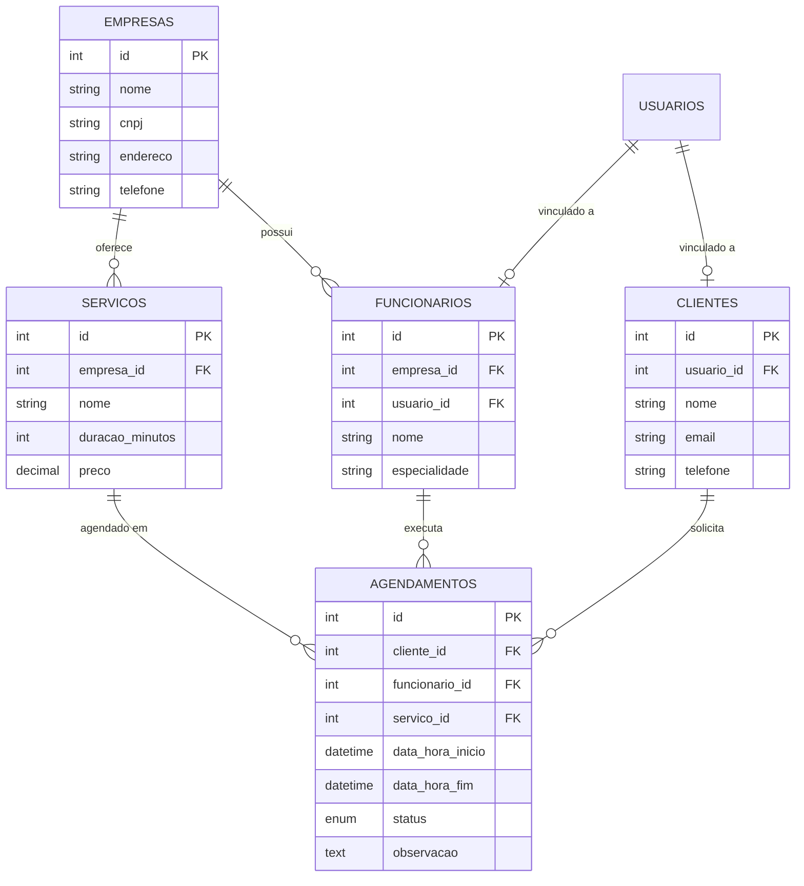

# AgendService - Plataforma de Agendamentos

[](LICENSE.md)

O **AgendService** é um sistema robusto para gestão de agendamentos de serviços, permitindo o controle de empresas, prestadores (funcionários), serviços e clientes.

## 🚀 Tecnologias Utilizadas

- **Backend:** Laravel 8.75 (PHP 8.1+)
- **Banco de Dados:** MySQL 8.0
- **Frontend:** Vue.js 3 + Tailwind CSS
- **Infraestrutura:** Docker (Nginx, PHP-FPM, MySQL)
- **Automação:** Makefile

## 🏗️ Arquitetura e Backend

O sistema segue o padrão RESTful com as seguintes camadas implementadas:

- **Models & Relationships:** Eloquent ORM com relacionamentos complexos.
- **API Resources:** Camada de transformação de dados para respostas JSON padronizadas.
- **Form Requests:** Validação de dados de entrada.
- **Business Logic:** Regras de negócio centralizadas nos Controllers (ex: cálculo automático de fim de serviço e prevenção de sobreposição).

### Diagrama de Entidade-Relacionamento (ERD)



## 🛠️ Endpoints Principais (API)

| Método | Endpoint                       | Descrição                         |
| ------ | ------------------------------ | --------------------------------- |
| `GET`  | `/api/empresas`                | Lista todas as empresas           |
| `POST` | `/api/agendamentos`            | Cria um novo agendamento          |
| `GET`  | `/api/clientes/{id}/historico` | Retorna o histórico de um cliente |
| `GET`  | `/api/servicos`                | Lista serviços disponíveis        |
| `PUT`  | `/api/agendamentos/{id}`       | Atualiza status ou horário        |

## 📊 Cobertura da API (Endpoints Funcionais)

| Recurso          | Endpoints | Operações Disponíveis                              |
| ---------------- | :-------: | -------------------------------------------------- |
| **Empresas**     |     5     | Listar, Criar, Ver, Atualizar, Remover             |
| **Serviços**     |     5     | Listar, Criar, Ver, Atualizar, Remover             |
| **Funcionários** |     5     | Listar, Criar, Ver, Atualizar, Remover             |
| **Clientes**     |     6     | Listar, Criar, Ver, Atualizar, Remover + Histórico |
| **Agendamentos** |     5     | Listar, Criar, Ver, Atualizar, Remover             |
| **Usuários**     |     5     | Gestão de perfis e acesso                          |
| **Autenticação** |     1     | Login de sistema                                   |

## ⚖️ Regras de Negócio Implementadas

1. **Prevenção de Sobreposição:** Um funcionário não pode ter dois agendamentos no mesmo intervalo de tempo.
2. **Cálculo Automático de Horário:** O sistema calcula a `data_hora_fim` somando a duração do serviço à `data_hora_inicio`.
3. **Status de Agendamento:** Fluxo controlado entre `pendente`, `confirmado`, `cancelado` e `concluido`.

## 🏁 Guia de Inicialização (Primeira Execução)

Siga estes passos na ordem para configurar o ambiente do zero:

1. **Subir containers:** `make up_build`
2. **Instalar dependências PHP:** `make composer_install`
3. **Instalar dependências JS:** `make npm_install`
4. **Configurar variáveis de ambiente:** `make env`
5. **Gerar chave da aplicação:** `make key`
6. **Ajustar permissões de pastas:** `make perm` (corrige erros de Log/Cache)
7. **Executar migrações do banco:** `make migrate`
8. **Popular com dados de teste:** `make seed`

---

## 🚀 Ferramentas de Teste e Coleta de Requisições (Bruno)

O projeto inclui uma coleção completa de requisições HTTP no formato .bru (Bruno), ideal para testar a API
de forma automatizada e organizada.

O que é Bruno?
Bruno é um cliente HTTP open-source focado em ser Git-friendly e offline-first. Ele utiliza arquivos de
texto plano (.bru) para cada requisição, facilitando o versionamento e a colaboração.

Benefícios de usar Bruno neste projeto:

- Versionamento Fácil: Requisições em texto puro são perfeitas para controle de versão com Git.
- Offline-First: Funciona localmente, sem dependências externas.
- Automação de Testes: Permite a criação de testes automatizados diretamente nos arquivos .bru (usando
  expect) e o encadeamento de requisições com scripts (capturando IDs, tokens, etc.).
- CLI para CI/CD: O Bruno possui uma linha de comando (bru) que permite executar coleções inteiras em
  pipelines de integração contínua.
- Organização: A coleção está estruturada em pastas por recurso, com variáveis de ambiente e sequências
  lógicas de testes (Criar -> Alterar -> Ler -> Remover).

Como usar a coleção:

1. Clone este repositório.
2. Instale o Bruno (ou o @usebruno/cli via npm: npm install -g @usebruno/cli).
3. Importe a pasta api-collection/ no seu cliente Bruno (ou use o CLI).
4. Configure a variável baseUrl em environments/Local.bru para http://localhost (ou a porta que o Nginx
   está exposto no Docker).
5. Execute as requisições em sequência (especialmente as de criação, atualização e remoção) para garantir
   a captura correta dos IDs dinâmicos e a validação dos fluxos.

---

### 🧪 Testes Automatizados

Para garantir a integridade do sistema, execute a suíte de testes:

```bash
make test
```

Ou se quiser ver a cobertura de testes:

```bash
make coverage
```
